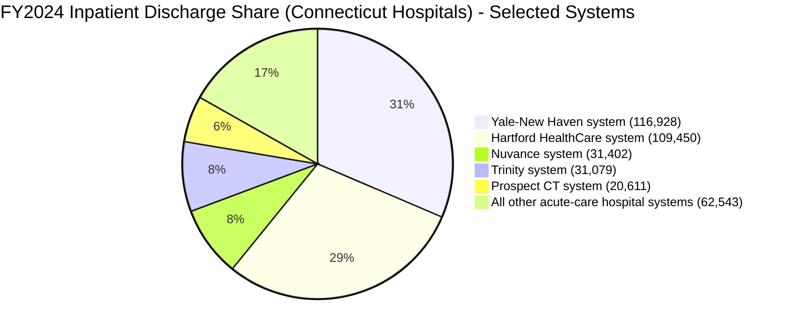
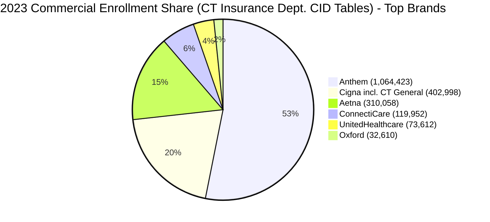

# Connecticut Healthcare Market and Regulatory Environment

## Executive Summary

Connecticut operates a dual-track Certificate of Need regime: a broad CON program for hospitals and other “health care facilities/institutions” under Title 19a (administered by the state’s entity["organization","Office of Health Strategy","state health planning agency | Hartford, CT, US"]) and a separate CON program for long-term-care facilities (administered by the entity["organization","Connecticut Department of Social Services","state medicaid agency | Hartford, CT, US"]). citeturn2view0turn12view0turn14view0

Connecticut’s modern hospital CON framework traces to Public Act 73-117 (1973) and remains in force, with repeated amendments through 2024–2025 (including governance changes that moved “final decision” authority into OHS leadership in the post-2018 structure, and updated statutory references in 2024). citeturn2view0turn35search19

The hospital CON program’s published application fee schedule is scaled to the “Estimated Cost of Proposal,” ranging from $1,000 to $10,000 depending on project cost bracket. citeturn3view0 The long-term-care CON program uses statutory capital-expenditure triggers (notably $1,000,000 with a size-expansion test, or $2,000,000, plus a major medical equipment trigger). citeturn12view0turn13search5turn14view0

On market structure, the state’s own consolidation analyses characterize most Connecticut hospital regions as “Highly” or “Very Highly” concentrated by HHI (Herfindahl–Hirschman Index), with the South Central region “Very Highly Concentrated” in both 2016 and 2021. citeturn30view0turn27view0 Financially, Connecticut’s two largest multi-hospital systems by FY2024 operating revenue were Yale-New Haven (about $7.13B) and Hartford HealthCare (about $6.50B), followed by Trinity Health of New England (about $1.71B). citeturn25view0turn18view0turn24view0

On insurer concentration in the commercial market, the entity["organization","Connecticut Insurance Department","state insurance regulator | Hartford, CT, US"] reports 2023 enrollment by carrier (fully insured and self-insured “other enrollment” combined, excluding government-sponsored plans). Based on those official enrollments, the top three brands by total enrollment share are Anthem (~53.1%), Cigna (~20.1%), and Aetna (~15.5%). citeturn34view0

## Regulatory Status & History

Connecticut has an active Certificate of Need law. The core hospital/health-facility CON authority is codified in Title 19a (Chapter 368z), including § 19a-638 (activities requiring a certificate of need). citeturn2view0

The statute history embedded in § 19a-638 shows the framework’s origins in Public Act 73-117 (1973) and extensive subsequent amendments, indicating “established” (in modern form) in 1973 and continuously revised rather than repealed. citeturn2view0turn2view0

Connecticut has also kept a separate CON regime for long-term-care facilities under Title 17b (Chapter 319y), with statutory definitions and requirements in §§ 17b-352 and 17b-353 (and related provisions, including a nursing home bed moratorium statute in § 17b-354). citeturn14view0turn13search5

A major structural reform occurred in 2018: legislation placed certificate-of-need decisions under OHS leadership (the Supreme Court’s description of the 2018 legislation notes that CON decisions were placed “under the purview of the OHS’s executive director,” citing Public Acts 2018, No. 18-91, § 15). citeturn35search19

More recently, the statutory history in § 19a-638 reflects continuing amendments through 2024, including language changes about OHS leadership titles (e.g., references to changing “executive director” to “commissioner” within the CON statute). citeturn2view0

## The Process

For hospital/health-facility CON applications, the reviewing and administering entity is the entity["organization","Office of Health Strategy Health Systems Planning Unit","con and health planning unit | Hartford, CT, US"], which the state describes as administering the CON program as part of OHS’s Health Systems Planning function. citeturn35search7turn35search22

Final decisions are issued within OHS leadership: OHS’s own CON decision guidance states that “the Office of Health Strategy Executive Director makes all final [CON] decisions” (with signature delegation sometimes used). citeturn35search8

Connecticut publishes a CON guidebook that describes the operational steps and timing mechanics (docketing, completeness review, review period, public hearing triggers, and decision issuance). This guidebook is the state’s primary “how-to” procedural artifact for applicants and the public. citeturn6view0

The published OHS application fee schedule is not a flat fee; it is bracketed by the proposal’s estimated cost. OHS lists fees from $1,000 (lowest cost bracket) up to $10,000 (highest cost bracket), with intermediate brackets for higher-cost projects. citeturn3view0

Statutory and regulatory timeframes are implemented through the state’s CON procedures (with additional timing impacts when a public hearing occurs and/or when the agency requests additional information). Because the agency’s timing can depend on application completeness, requests for information, and hearing events, the practical “clock” often differs from the base review-period concept described in the guidebook and governing law. citeturn6view0turn35search19

For long-term-care CONs under DSS, the process is explicitly statute-driven and includes a pre-application letter-of-intent mechanism: § 17b-352 requires that a “current letter of intent” be on file for at least 10 business days before an application is considered submitted, and defines “current” as not more than 180 days old. citeturn14view0 The same statute sets a baseline 90-day decision period for DSS (“grant, modify or deny … within ninety days of receipt”), with limited extensions (e.g., an additional 15 days upon applicant request when DSS requests additional information after the review period starts, and up to a 30-day extension by the responsible DSS official for untimely information submission). citeturn14view0

Incumbent competitors’ ability to object/intervene differs by pathway but exists functionally in the hospital CON program via public access, public hearing procedures, and administrative-law doctrines. Connecticut publishes a public-hearing request form and describes public access to pending and past applications through the CON portal, enabling objections and participation to be organized and filed. citeturn3view0turn35search7 In contested-case litigation involving CON, Connecticut courts have addressed when a CON determination constitutes a “final decision in a contested case,” which directly affects who can participate and appeal (e.g., the High Watch case discusses the post-2018 placement of CON authority in OHS leadership and the contested-case issue). citeturn35search19

## Scope of Regulation

The hospital/health-facility CON statute (Title 19a) regulates a wide set of transactions and service changes. Section 19a-638 lists multiple categories requiring a CON, including (at a minimum): establishment of new health care facilities/institutions; transfers of ownership; termination of services; certain expansions/changes in bed capacity; and acquisition of specified major diagnostic or treatment equipment categories (the statute enumerates acquisitions such as CT, MRI, PET, PET/CT, and non-hospital-based linear accelerators, among others). citeturn2view0

The same statute also contains notable exclusions: it states that a certificate of need “shall not be required” for categories including residential care homes, nursing homes, and rest homes, reflecting Connecticut’s split regulatory architecture in which long-term-care CON oversight is generally located in Title 17b/DSS rather than Title 19a/OHS. citeturn2view0turn12view0

Capital expenditure thresholds are not expressed as a single statewide “magic number” for hospital CON triggers in § 19a-638; instead, Connecticut’s Title 19a program is structured around enumerated actions and defined project types (including equipment categories) that trigger review. citeturn2view0turn6view0

By contrast, Connecticut’s long-term-care CON statutes include explicit capital-expenditure and equipment thresholds. DSS describes review triggers including: capital expenditures exceeding $2,000,000; or capital expenditures exceeding $1,000,000 that also increase facility square footage by more than 5,000 square feet or 5% (whichever is greater); and acquisition of major medical equipment exceeding $400,000. citeturn12view0turn13search5 This orientation is reinforced in § 17b-353’s statutory text (capital expenditures exceeding $1,000,000 with the square-footage test, or exceeding $2,000,000). citeturn13search5

The long-term-care scope is also explicitly defined: § 17b-352 defines “facility” to include (among others) Medicaid-participating ICF/IID facilities, nursing homes, rest homes, and residential care homes, with an express exclusion for certain non-Medicaid nursing homes associated with continuing care facilities. citeturn14view0

## Market Concentration

Connecticut’s own consolidation analysis characterizes most hospital regions as highly concentrated by HHI. In the state-commissioned consolidation report (covering 2016–2021), seven of nine regions were “Highly Concentrated” in 2016 and one was “Very Highly Concentrated”; in 2021, the “South Central” region remained “Very Highly Concentrated” (HHI 6,699). citeturn30view0turn27view0

### Top health systems

The entity["organization","Connecticut Office of Health Strategy Hospital Financial Stability Report","fy2024 hospital financial report | CT, US"] reports audited “Statement of Operations” metrics for each multi-hospital system for FY2021–FY2024 (Connecticut facilities only, where systems include out-of-state components). By FY2024 total operating revenue, the three largest multi-hospital systems are:

- entity["organization","Yale-New Haven Health Services Corporation","connecticut multi-hospital system"]: $7.126B total operating revenue (FY2024). citeturn25view0  
- entity["organization","Hartford HealthCare Corporation","connecticut multi-hospital system"]: $6.497B total operating revenue (FY2024). citeturn18view0  
- entity["organization","Trinity Health of New England, Inc.","connecticut regional health system"]: $1.713B total operating revenue (FY2024). citeturn24view0  

The next-largest multi-hospital system by FY2024 operating revenue is entity["organization","Nuvance Health, Inc.","regional health system | CT/NY"] at $1.511B (FY2024, Connecticut-licensed component). citeturn22view4

image_group{"layout":"carousel","aspect_ratio":"16:9","query":["Yale New Haven Health Services Corporation logo","Hartford HealthCare logo","Trinity Health of New England logo","Nuvance Health logo"],"num_per_query":1}

### Highly concentrated local markets

Using Connecticut’s region definitions and hospital lists from the OHS-commissioned consolidation report and combining them with FY2024 hospital discharge totals (OHS Hospital Financial Stability Report, Appendix T), several regions functionally behave as near-duopolies (or have a dominant system).

In the “Greater Bridgeport” region (Bridgeport, Saint Vincent’s, and Yale-New Haven hospitals listed as having PSAs in the region), FY2024 inpatient discharges are heavily dominated by the Yale-New Haven system: 91,358 discharges versus 14,893 for the Hartford HealthCare system, implying approximately 86.0% vs 14.0% of discharges among that region’s listed hospitals. This aligns with the region’s “Highly Concentrated” HHI classification in both 2016 and 2021. citeturn30view0turn31view0

In the “South Central” region (Bridgeport, Midstate, Hartford, Saint Vincent’s, Yale-New Haven hospitals), the discharges among the region’s listed hospitals split across two systems: 91,358 discharges for the Yale-New Haven system and 73,903 for Hartford HealthCare, implying approximately 55.3% vs 44.7%. The consolidation report classifies the South Central region “Very Highly Concentrated” in 2016 and 2021 (HHI 6,477 and 6,699). citeturn30view0turn31view0

In the “Southeastern” region (Lawrence + Memorial, Hartford, Windham, Backus hospitals listed), Hartford HealthCare-affiliated hospitals account for about 81.6% of discharges among the listed hospitals (62,174 of 76,193), with the remainder in the Yale-New Haven system (Lawrence + Memorial’s 14,019). citeturn30view0turn31view0

Method note: these regional shares are arithmetic combinations of (a) the consolidation report’s “hospitals with PSAs in each region” lists and (b) FY2024 discharge totals by hospital. They reflect discharges at the listed hospitals, not a claims-based “market share” of all residents in the region across all potential hospitals (including out-of-state). citeturn30view0turn31view0turn27view0

### Top insurance carriers and market shares

The Connecticut Insurance Department’s 2024 Consumer Report Card includes “Managed Care Organizations – 2023 Enrollment” tables with enrollment split into “Fully Insured” and “Other Enrollment” (self-insured), and notes that “*Fully Insured plans do not include government sponsored plans.” citeturn34view0

Using the state-reported 2023 enrollment totals (fully insured + other enrollment combined), the top three insurer brands by total enrollment share in Connecticut’s commercial managed-care market are:

- entity["company","Anthem Health Plans, Inc.","connecticut commercial insurer"]: 1,064,423 enrollees (≈53.1% of 2,003,688 total). citeturn34view0  
- entity["company","Cigna Health and Life Insurance Company","commercial insurer | CT filings"] (plus Connecticut General in the CID tables): 402,998 enrollees (≈20.1%). citeturn34view0  
- entity["company","Aetna Life Insurance Company","commercial insurer | CT filings"] (plus Aetna Health in the CID tables): 310,058 enrollees (≈15.5%). citeturn34view0  

If the focus is the *fully insured* segment only (often most sensitive to state-regulated small-group and individual dynamics), the top three brands by fully insured enrollment are Anthem (~24.8%), ConnectiCare (~21.2%), and Aetna (~17.8%), based on the same CID tables. citeturn34view0

### Provider-sponsored plans

The OHS FY2024 hospital financial stability report includes organizational charts of health systems and their affiliated entities, and notes that affiliates may include insurance entities. citeturn16view0turn16view0 One explicit example in the report’s health system charts is that entity["organization","Griffin Health Services Corporation","connecticut hospital system"] includes an entity labeled “Healthcare Alliance Insurance Co. Ltd” within its organizational structure. citeturn16view0

### Comparative table

| Category | Organization | Latest revenue / market share metric | Year | Source |
|---|---|---:|---:|---|
| Health system | Yale-New Haven Health Services Corporation | Total operating revenue: $7,126,370,000 | FY2024 | OHS Hospital Financial Stability Report table for the system. citeturn25view0 |
| Health system | Hartford HealthCare Corporation | Total operating revenue: $6,496,922,000 | FY2024 | OHS Hospital Financial Stability Report table for the system. citeturn18view0 |
| Health system | Trinity Health of New England, Inc. | Total operating revenue: $1,713,445,000 | FY2024 | OHS Hospital Financial Stability Report table for the system. citeturn24view0 |
| Insurer (brand) | Anthem | Share of CID-reported commercial enrollment: ~53.1% (1,064,423 / 2,003,688) | 2023 | CID Consumer Report Card enrollment tables; share computed from those enrollments. citeturn34view0 |
| Insurer (brand) | Cigna (incl. Connecticut General) | Share of CID-reported commercial enrollment: ~20.1% (402,998 / 2,003,688) | 2023 | CID Consumer Report Card enrollment tables; share computed from those enrollments. citeturn34view0 |
| Insurer (brand) | Aetna | Share of CID-reported commercial enrollment: ~15.5% (310,058 / 2,003,688) | 2023 | CID Consumer Report Card enrollment tables; share computed from those enrollments. citeturn34view0 |

The hospital discharge totals used below for system-level discharge “market share” (a utilization proxy) are drawn from OHS’s Appendix T (FY2024 discharge totals by hospital) and can be aggregated to system totals (e.g., Yale-New Haven system: 116,928; Hartford HealthCare system: 109,450). citeturn31view0turn18view0

## Case Law & Scandals

A documented denial exists in the state’s archived CON decision lists. For example, the OHS CON Decisions 2012 page lists a denial for a transaction involving entity["organization","Eastern Connecticut Health Network, Inc.","connecticut health system"] and Mandell & Blau, M.D.’s P.C.: “Acquisition … of the Open MRI scanners …” under Docket No. 11-31737-CON (dated September 25, 2012) is shown as “denied.” citeturn35search4 The publicly visible decision-list entry does not provide a detailed narrative rationale; the specific reasons for denial are therefore **Data not publicly available** from the published summary alone. citeturn35search4

On CON-related case law with direct implications for participation and appeal rights, the Connecticut Supreme Court’s High Watch decision addresses whether an agency’s CON action constituted a “final decision in a contested case,” and explains that 2018 legislation shifted CON decision authority under OHS leadership (Public Acts 2018, No. 18-91, § 15) while preserving certain independent decision-making authority for legacy-completed applications. citeturn35search19 These procedural doctrines matter in practice because (i) contested-case status and (ii) statutory authority and delegation define who can intervene, who is a “party,” and who can take an administrative appeal. citeturn35search19

Connecticut’s hospital consolidation and ownership-change landscape has also produced high-profile CON-related negotiated outcomes rather than pure approvals/denials. OHS’s FY2024 financial stability report describes a stalled (and then litigated) attempted acquisition involving entity["organization","Prospect Medical Holdings, Inc.","hospital operator | us"]’s Connecticut assets and a March 27, 2024 agreed-settlement approval of a transfer of ownership (followed by litigation between applicants and Prospect’s eventual Chapter 11 filing). citeturn20view3turn16view0