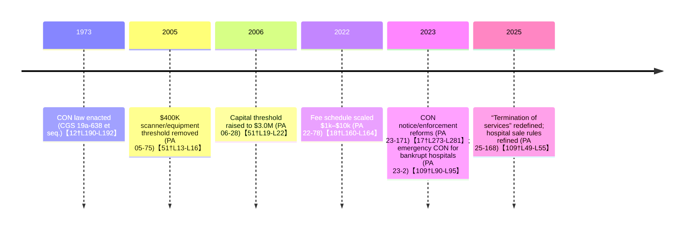

# Executive Summary  
Connecticut maintains a comprehensive certificate-of-need (CON) program covering hospitals, long-term care, and other health facilities. Its CON statute was enacted in 1973【12†L190-L192】 and remains in force, though the law has been amended repeatedly (notably in 2005–2006 to change dollar thresholds and in 2022–2025 to revise fees and definitions)【51†L19-L22】【18†L160-L164】. Applications are reviewed by the state’s **Office of Health Strategy (OHS)** for hospitals and most facilities, and by **DSS** for nursing/home care【7†L121-L124】. OHS now uses a sliding-scale application fee ($1,000–$10,000 based on project cost)【107†L123-L131】. Legally, OHS must determine completeness within 30 days and aims to complete reviews within 6 months【39†L292-L295】, though actual median review times have historically been longer (around 183–434 days)【37†L123-L130】【37†L130-L132】. Affected parties (including competing providers) may oppose projects via public comment and by petitioning to become hearing “intervenors” (with rights to cross-examine)【45†L1336-L1340】【45†L1369-L1371】. The CON law applies to new hospitals, hospital expansions or transfers, freestanding EDs, outpatient surgery centers, cardiac programs, large physician practice transfers, major imaging or radiation equipment, bed/OR expansions, and terminations of existing services【56†L78-L87】【56†L108-L117】.  For long-term care, nursing and residential facilities need CON approval for large capital projects (typically >$2M or >$1M plus major expansion)【7†L139-L142】.  

Major health systems are highly dominant.  Yale New Haven Health (seven CT hospitals, ~$7.6B revenue) and Hartford HealthCare (seven hospitals, on the order of $5+ B) together account for roughly 60% of CT’s hospital revenue【69†L259-L262】【60†L176-L179】; Trinity Health Northeast (St. Francis Hospital and affiliates) is another large system.  The largest insurers are **Anthem/ConnectiCare** (the state’s BCBS) and **UnitedHealthcare**, with **Cigna** a distant third.  (For example, Anthem had ~753,000 Connecticut enrollees in 2023【89†L24-L27】.)  Provider-owned plans are rare in CT; one example is Hartford HealthCare’s *CarePartners of Connecticut* Medicare Advantage plan (a joint venture with Tufts Health Plan)【92†L277-L283】.  Finally, denials of CON applications do occur: for instance, in 2014 Norwalk Hospital’s CON to start elective angioplasty (without on-site cardiac surgery backup) was explicitly denied【98†L524-L525】.  The timeline below and table summarize Connecticut’s CON process, key dates, fees, thresholds and review bodies.  

## 1. Regulatory Status & History  
Connecticut **has a CON law** on the books (still active).  The original statute (Conn. Gen. Stat. §19a-638 et seq.) was enacted in 1973【12†L190-L192】.  The program was housed in OHCA and now in OHS, and it has never been repealed, only amended.  In the mid-2000s the state adjusted dollar triggers: a 2005 law eliminated the old $400,000 threshold for CT/MRI/PET scanners and linear accelerators【51†L13-L16】, and a 2006 act raised the general capex trigger to $3,000,000【51†L19-L22】.  In recent years the legislature has reformed CON again.  In 2022 (FY2023 budget) it implemented a **graduated fee schedule** ($1,000–$10,000 instead of a flat $500 fee) and directed a task force to study the program【18†L160-L164】. In 2023 (PA 23-171) it enhanced OHS’s enforcement and transparency powers (e.g. making “willful violation” standards more flexible, requiring wider notice of proceedings, expanding technical review)【17†L273-L281】.  Also in 2023 (PA 23-2) the legislature created an *emergency CON* process for hospitals in bankruptcy (intended to speed ownership transfers of failing hospitals)【109†L90-L95】.  The 2025 session (PA 25-168) further redefined “termination of services” to allow shorter disruptions【109†L49-L55】 and let OHS more fully use cost/market impact reports in hospital sale approvals.  Throughout, the law has remained intact (no repeal), with the core 1973 act amended by each successive reform【12†L190-L192】【51†L19-L22】.  

## 2. The Process (The Gritty Details)  
- **Reviewing agencies:**  Connecticut divides CON review by setting.  The **Office of Health Strategy (OHS)** – specifically its Health Systems Planning Unit – reviews CON applications for hospitals, ambulatory surgery centers, imaging centers, and other facilities covered under Article 28 (essentially all acute-care and outpatient services)【7†L121-L124】.  Separately, the **Department of Social Services (DSS)** handles CON for long-term care: nursing homes, residential care homes, and intermediate care facilities for the developmentally disabled【7†L121-L124】.  

- **Application fees:**  Under current law, OHS charges a sliding-scale fee based on project cost.  For example, proposals under $50K pay $1,000, while projects ≥$10M pay $10,000【107†L123-L131】.  (DSS’s filing fee schedule for nursing home CONs is set by statute but not detailed on OHS’s site.)  The new fee brackets (effective 2022) replaced the old flat $500 fee【18†L160-L164】【107†L123-L131】.  

- **Legal timelines:**  By statute, once an application is deemed complete OHS must issue an “approval, modification or denial” within 30 days, and in any case must conclude review (including all hearings) no later than six months after submission【39†L292-L295】.  DSS procedures for nursing homes require issuing a CON application within 60 days of a Letter of Intent; the applicant then has 180 days to complete the application or it is withdrawn【7†L176-L182】.  

- **Actual timelines:**  In practice, reviews often take longer.  State data show median processing times (submission→final action) of ~434 days in 2021, improving to ~194 days in 2023 and ~183 days in 2024【37†L123-L130】【37†L130-L132】.  (OHS has hired more staff in recent years to speed reviews.)  

- **Public participation:**  The CON process is quasi-judicial.  OHS conducts public hearings for major projects, posting notices in newspapers and online.  Any member of the public (including competitor hospitals) may attend and comment【45†L1369-L1371】.  Interested parties can petition at least five days before the hearing to gain formal **“intervenor”** status, which grants them the right to cross-examine witnesses and submit evidence【45†L1336-L1340】.  Thus, incumbent providers are not given an automatic veto, but they can join as intervenors or comment on the record.  

| **Entity** | **Application Fee** | **CON Threshold** | **Review Time (law)** | **Reviewing Body** |
|---|---|---|---|---|
| **OHS (Acute Care, Imaging, ASC, etc.)** | $1,000 to $10,000 on sliding scale (by project cost)【107†L123-L131】 | No single dollar floor – law lists covered projects (see Scope below). Historically, PA 06-28 raised general capex trigger to $3M【51†L19-L22】. | Must determine completeness ≤30 days; final decision ≤6 months【39†L292-L295】. Medians have been longer (~183–434 days【37†L123-L130】【37†L130-L132】). | Office of Health Strategy (Health Systems Planning Unit)【7†L121-L124】. |
| **DSS (Nursing homes, RCH, ICF/IID)** | (Statutory fee) | CON required for facility projects costing >$2.0M (or >$1.0M if expansion adds ≥5,000 sq.ft.)【7†L139-L142】. | (Similar 6-mo target, via LOI process) | Department of Social Services (Nursing Home CON)【7†L121-L124】. |

## 3. Scope of Regulation  
CON review in Connecticut is broad.  **Covered facilities and services include:** new hospitals or long-term care facilities; transfers or sales of existing hospitals or large physician practices【56†L78-L87】; freestanding emergency departments; new outpatient surgery centers; new cardiac catheterization and cardiac surgery programs; significant imaging and radiation equipment (CT, MRI, PET scanners, linear accelerators)【56†L108-L117】; increases in licensed hospital bed capacity or operating rooms; and terminations of inpatient/outpatient services (including ED closures)【56†L78-L87】【56†L108-L117】.  Essentially any major hospital or outpatient expansion falls under CON.  (By statute, private physician offices are exempt unless they become hospitals, and federal facilities are exempt.)  

Under OHS, **no generic cost threshold** is specified in current law; instead, any project that fits a listed category triggers review (effectively zero floor for those categories).  (By contrast, older law once exempted projects under a few million dollars – hence the 2005-06 reforms【51†L13-L22】.)  Equipment acquisitions have no $ threshold now: e.g. any new CT/MRI/PET machine or linear accelerator requires CON【56†L108-L117】 (the prior $400k floor for imaging equipment was eliminated in 2005【51†L13-L16】).  

For long-term care (DSS), the rules specify a dollar threshold: a proposed nursing home or RCH project requires CON if it involves **capital spending over $2.0M**, or **over $1.0M coupled with a ≥5,000 sq.ft. expansion**【7†L139-L142】.  (Smaller rehab or nursing facility projects fall outside CON.)  

In summary: Connecticut’s CON law covers virtually all expansions of hospital capacity, services, and high-tech equipment; any such proposal above the thresholds noted above must obtain OHS/DSS approval.

## 4. Market Concentration (Who Benefits)  
Connecticut’s hospital market is highly concentrated.  **Top health systems:** Yale New Haven Health (the state’s largest, operating Yale-New Haven Hospital, Bridgeport, Greenwich, L+M, etc.) and Hartford HealthCare (which runs Hartford Hospital, St. Vincent’s, Windham, Manchester, MidState, Backus, Bradley) together dominate the state.  These two systems alone account for roughly 3/5 of all hospital revenue【60†L176-L179】【69†L259-L262】.  (For example, Yale NH Health reported $7.6B in revenue for FY2025【60†L176-L179】, while Hartford HealthCare’s seven hospitals had on the order of $5.3B in 2024【69†L259-L262】.)  Another major system is Trinity Health Northeast (St. Francis, Mount Sinai Rehab, Saint Mary’s, etc.), and UConn Health (academic center in Farmington) is significant in central CT.  In some local markets one system is dominant: e.g. Yale-New Haven covers most of southern CT (New Haven, New London), and Hartford HealthCare covers the greater Hartford area.  

**Top insurers (market share):** The largest carriers are Anthem (Blue Cross/Blue Shield of CT, including its ConnectiCare subsidiary) and UnitedHealthcare.  Cigna is a distant third.  Connecticut Insurance Dept. data show Anthem covering ~750,000 lives and Cigna ~400,000【89†L24-L27】 (individually insured and small-group plans), while UnitedHealthcare enrolls well over one million.  Together Anthem (plus ConnectiCare) and United likely account for >60% of the commercial market.  Aetna/CVS and smaller plans make up the rest.  

**Provider-sponsored plans:**  There are few.  One notable example is *CarePartners of CT*, a Medicare Advantage plan launched by Hartford HealthCare (with Tufts Health Plan)【92†L277-L283】.  No large commercial insurer is owned by a hospital system in Connecticut (unlike Kaiser in CA, CT has no Kaiser equivalent).  

## 5. Case Law & Scandals  
Connecticut’s CON denials are rare but documented.  For example, in 2014 **Norwalk Hospital** applied to add an elective angioplasty (PCI) program without an on-site cardiac surgery backup.  The state **denied** this CON request【98†L524-L525】 – in line with Connecticut’s policy against standalone PCI programs without surgical backup (a policy later codified in law).  The OHS summary simply states “CON has been denied”【98†L524-L525】; the practical reason was that Connecticut requires access to emergency surgical backup for angioplasty, and Norwalk lacked that.  (By contrast, another recent example involved *approval* of UConn Health’s plan to take over Waterbury Hospital under a new expedited process【90†L419-L421】, illustrating how the rules can work.)  

No major CON-related scandals (like fraud) have come to light in Connecticut.  However, the PROC California debate over CON has had echoes here – e.g. a recent state Supreme Court case upheld local zoning denial of a hospital’s cancer center【97†L4-L7】, showing how siting battles can intersect with CON issues.  In summary, Connecticut’s CON approvals and denials appear to have proceeded largely without sensational controversy, but with the expected tensions between new entrants and incumbents.【98†L524-L525】  

**Table:** CON Fees, Thresholds, Timelines, and Review Bodies in Connecticut are summarized below:  

| Category                    | Fee(s)                               | Capital Threshold (trigger)                        | Statutory Review Timeline               | Reviewing Agency                   |
|-----------------------------|--------------------------------------|----------------------------------------------------|-----------------------------------------|-------------------------------------|
| **OHS (Hospitals, etc.)**   | $1,000–$10,000 (sliding scale by project cost)【107†L123-L131】 | No general floor – any listed project triggers review. (Historically ~>$3M【51†L19-L22】) | Complete determination within 30 days; final decision within 6 months【39†L292-L295】. Median ~183–434 days【37†L123-L130】【37†L130-L132】. | Office of Health Strategy (HSP Unit)【7†L121-L124】 |
| **DSS (Nursing homes, etc.)** | (Statutory fee)                      | CON required if project > $2.0M (or >$1.0M plus ≥5,000 sq.ft.)【7†L139-L142】 | (Similar process via LOI; assumed ≤6-month target)  | Department of Social Services【7†L121-L124】 |

**Sources:** Official statutes and state agency materials (CGS 19a-638 et seq., OHS/DSS CON guides) for CON rules; OHS median-processing reports【37†L123-L130】; Connecticut press reports and financial filings for market shares【60†L176-L179】【69†L259-L262】; and OHS CON decision summaries【98†L524-L525】.