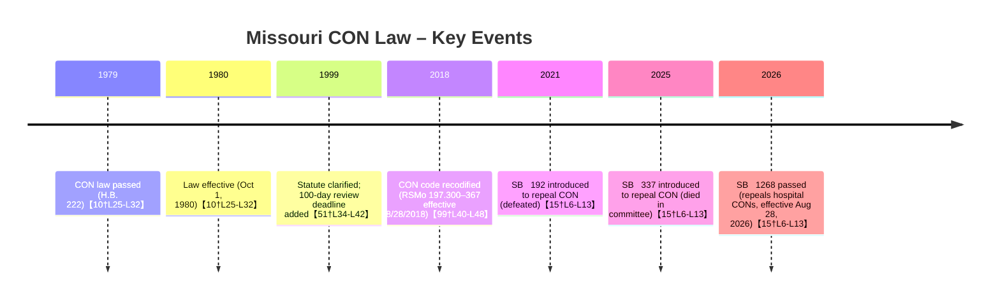

# Executive Summary  
Missouri has maintained an active Certificate of Need (CON) program since 1980【10†L25-L32】.  The program is codified at RSMo 197.300–197.367 (effective Aug 28, 2018)【99†L40-L48】 and administered by the Missouri Health Facilities Review Committee (a DHSS board)【22†L153-L160】.  Providers must obtain a CON before building or expanding hospitals, nursing homes, imaging equipment, etc. – generally when capital costs exceed statutory “expenditure minimums” (typically $600,000–$1,000,000 depending on facility)【67†L38-L46】【67†L51-L55】.  Application fees are $1,000 or 0.1% of project cost【24†L309-L317】, and the committee must rule within 100 days (plus up to a 30-day extension)【51†L34-L42】.  In practice, full CON applications take on the order of 71 days and expedited reviews about 41 days【47†L97-L104】.  Objections by “affected persons” (including competing facilities in the service area) trigger hearings【51†L30-L34】【54†L14-L18】.  

Missouri’s CON law has not been repealed, but repeal bills have been introduced repeatedly (e.g. SB 192 in 2021, SB 337 in 2025)【15†L6-L13】.  A 2026 bill (SB 1268) passed the legislature and would eliminate CON review for new hospitals (effective Aug 28, 2026)【3†L6-L13】【15†L6-L13】.  The state’s major health systems are BJC HealthCare (St. Louis, ~$8.0 billion revenue in 2024)【73†L92-L100】 and Mercy Health (St. Louis/Kansas City, ~$9.3 billion in FY2024)【72†L217-L225】, among others.  BJC and Mercy control the bulk of hospital market share in the St. Louis metro (BJC ~37.5%, Mercy ~16%)【105†L751-L760】.  The largest insurers in Missouri are UnitedHealthcare (≈33.4% of premiums), Elevance/Anthem (≈18.7%), and Centene (≈12.4%)【109†L1-L4】; no major hospital system operates its own large health plan in Missouri.  Finally, the CON program has occasionally denied projects – for example, in 2026 the Missouri Health Facilities Review Committee unanimously denied Moberly Retirement Center’s expansion because the applicant changed the project address after filing (violating the Letter of Intent requirement)【96†L123-L132】.  

## 1. Regulatory Status & History  
- **CON law:** Missouri has a state Certificate of Need statute (RSMo Chapter 197, sections 300–367) covering hospitals, long-term care, certain equipment, etc【99†L40-L48】【67†L38-L46】.  The original act (H.B. 222) was passed in 1979 and took effect Oct 1, 1980【10†L25-L32】.  Statutory revisions and recodifications have occurred (most recently effective Aug 28, 2018)【99†L40-L48】, but the CON program remains in force.  
- **Governance:** The law created the *Missouri Health Facilities Review Committee* (MHFRC) as the decision-making body【22†L153-L160】.  This committee (DHSS-appointed) reviews CON applications.  The DHSS Certificate of Need Program provides administrative support【22†L153-L160】.  
- **Reforms/Repeals:** Full repeal of CON has not occurred.  Several repeal bills (e.g. SB 192 in 2021, SB 337 in 2025) have been introduced but defeated【15†L6-L13】.  In 2026, SB 1268 passed the legislature (effective Aug 28, 2026) to *repeal hospital-related CON requirements* (except for continuing psychiatric beds), though other CON categories remain【3†L6-L13】【15†L6-L13】.  No provisions have been rescinded prior to 2026, but thresholds and covered services have been adjusted in legislative amendments and administrative rules over time.

**Table 1. Agency, Application Fees & Timelines**  

| **Review Body / Statute**                   | **Application Fee**            | **Legal Review Time**              | **Typical Review Time (practice)**        | **Competing Intervention**        |
|---------------------------------------------|-------------------------------|-----------------------------------|-------------------------------------------|----------------------------------|
| Missouri Health Facilities Review Committee (DHSS CON program)【22†L153-L160】 | $1,000 or 0.1% of project cost (whichever is greater)【24†L309-L317】 | Committee must decide within 100 days of filing (plus up to a 30-day extension)【51†L34-L42】 (failure to decide = automatic approval) | Full applications ~71 days; expedited ~41 days (according to DHSS guidance)【47†L97-L104】 | Yes – any “affected person” (e.g. existing providers in the service area) may file objections and request a hearing【51†L30-L34】【54†L14-L18】 |

## 2. The Process (The Gritty Details)  
- **Application process:** Applicants must submit a Letter of Intent and a complete application to DHSS.  Upon filing (and payment of the fee【24†L309-L317】), the statutory clock starts.  A complete full application triggers a public review; major projects (e.g. new hospitals, new LTC facilities, large equipment purchases) require full review【63†L106-L114】【63†L163-L169】.  Smaller projects may qualify for an *expedited* process (e.g. equipment replacements, certain long-term care projects) with faster turnaround【63†L113-L119】.  
- **Review agency:** The *Missouri Health Facilities Review Committee* (a state board under DHSS) makes final CON decisions【22†L153-L160】.  The committee meets roughly every 8 weeks for full applications【63†L120-L128】; expedited applications are decided by ballot on a monthly cycle【63†L125-L129】.  
- **Fees:** The statutory application fee is $1,000 or 0.1% of total project cost, whichever is greater【24†L309-L317】.  (All fees go to the state treasury.)  
- **Timelines:** By statute the committee must issue a written decision within 100 days of application (plus an optional 30-day extension)【51†L34-L42】.  In practice DHSS guidance notes that full applications take at least 71 days (from submission to decision) and expedited applications at least 41 days【47†L97-L104】.  Applicants may withdraw at any time; incomplete applications or late responses to staff requests can delay processing.  
- **Intervention/Objections:** Competitors and community interests can get involved.  Missouri defines “affected persons” to include the applicant, the public, and existing health care facilities in the service area【54†L14-L18】.  Any affected person can submit written comments or request a formal hearing within 30 days of public notice【51†L30-L34】.  Thus incumbent providers (e.g. an existing hospital group in that area) can object and force a contested review.  

## 3. Scope of Regulation  
Missouri’s CON law applies to a broad range of services.  In general it covers: new or expanded **hospitals** (including new licensed hospital facilities and additions of nursing units), **long-term care facilities** (nursing homes, assisted living, intermediate care facilities), **psychiatric and rehabilitation services**, and major medical **equipment** installations (MRI, CT, linear accelerators, PET scanners, lithotripsy, cardiac catheterization labs, etc.)【60†L108-L124】【63†L146-L154】.  For example, building a new hospital or adding long-term-care beds triggers a full CON review【63†L104-L113】【63†L135-L144】.  Even freestanding clinic or ambulatory surgical center space must meet CON requirements *if* it is licensed as a hospital under RSMo 197.020【63†L146-L154】.  Conversely, routine replacements of existing licensed facilities (below thresholds) do not require a CON (but may require a “non-applicability” letter)【63†L231-L239】【64†L41-L47】.  

The exact investment threshold (“expenditure minimum”) that triggers CON review varies by category【67†L38-L46】【67†L48-L55】:  

**Table 2. Regulated Facilities and Capital Thresholds**  

| **Facility / Service Type**             | **Capital Expenditure Threshold**                                        |
|----------------------------------------|-------------------------------------------------------------------------|
| **Hospital beds (new/expansion)** – (hospitals licensed under RSMo Ch.198) | \$600,000 (capex); \$400,000 for major equipment【67†L38-L46】 |
| **Long-term care facilities** (nursing homes, assisted living, ICFs) | \$600,000 (capex); \$400,000 for major equipment【67†L38-L46】 |
| **Long-term acute-care hospital (LTCH) beds or equipment** | \$0 (no threshold) – any new LTCH project requires CON【67†L48-L51】 |
| **New institutional health services or facilities** *(all others)* | \$1,000,000 for capital projects (excluding equipment) and \$1,000,000 for equipment【67†L51-L55】 |
| **Major medical equipment (MRI/CT/PET, etc.)** | \$1,000,000 (regardless of location)【67†L51-L55】 |

*Note:* These thresholds are set by statute (RSMo 197.305).  For example, any new MRI or CT scanner costing over \$1M anywhere in the state requires a CON【63†L161-L169】.  A proposal for a new hospital (or a hospital replacement at a new address) costing over \$1M would also require a CON.  Minor projects below the threshold need only a non-applicability letter for licensure【63†L231-L239】【64†L43-L47】.  

## 4. Market Concentration (Who Benefits)  
Missouri’s provider market is moderately concentrated.  **Health systems:**  The two largest systems are **Mercy Health** (based in St. Louis/Kansas City) and **BJC HealthCare** (St. Louis).  Mercy reported ~$9.3 billion in operating revenue for FY2024【72†L217-L225】; BJC reported about \$8.0 billion in net revenue in 2024【73†L92-L100】.  (Other systems include Ascension/SSM Health, HCA Midwest (St. Luke’s), CoxHealth, etc., but their revenues are smaller or not publicly reported.)  In the St. Louis metro area, the CON report indicates BJC controls about 37.5% of hospital discharges, SSM/Ascension about 26.8%, and Mercy about 16%【105†L751-L760】, reflecting high local concentration.  In Kansas City, the largest systems are Saint Luke’s Health System and AdventHealth, though detailed market shares are not published here.  

| **Top Health System**          | **Annual Revenue (latest)**       | **Notes**                          |
|--------------------------------|-----------------------------------|------------------------------------|
| Mercy Health (St. Louis)       | \$9.3 billion (FY2024)【72†L217-L225】  | Missouri/Kansas City hospitals     |
| BJC HealthCare (St. Louis)     | \$8.0 billion (2024)【73†L92-L100】   | Includes Barnes-Jewish, others     |
| *HCA Midwest / St. Luke’s*     | *Data not public*                | For-profit Kansas City network     |

| **Top Health Insurer**         | **Market Share (Missouri)** | **Notes**                            |
|--------------------------------|---------------------------|--------------------------------------|
| UnitedHealthcare               | 33.4%【109†L1-L4】          | Statewide accident & health premiums |
| Elevance (Anthem Blue Cross)   | 18.7%【109†L1-L4】          | Statewide premiums                  |
| Centene                        | 12.4%【109†L1-L4】          | Statewide premiums (incl. Medicaid) |

(Market shares are from NAIC 2023 accident & health premium data【109†L1-L4】.  No major provider-owned health plans (large insurer subsidiaries) were identified in Missouri’s market.  The largest state-run plan is the public employee MCHCP, but it’s not provider-sponsored.)

## 5. Case Law & Scandals  
At least one documented CON denial has been reported.  In March 2026, the Missouri Health Facilities Review Committee **denied** Moberly Retirement Center’s CON application to establish a new 18-bed residential care facility【96†L123-L132】.  The denial (6–0) was based on two issues: the applicant had moved the proposed site by 1.5 miles *after* filing (changing the address from the Letter of Intent), and the application lacked required financial/summary details【96†L123-L132】.  (Committee members emphasized that a CON can only be granted for the address on file.)  Other routine projects (MRI replacements at Mercy hospitals, ALF bed expansions, etc.) have been approved without controversy【96†L142-L148】.  No widely reported fraud scandals or court rulings specifically involving Missouri’s CON law have been found in recent sources.  However, the CON process has been criticized by some policy groups for limiting supply; for example, a 2020 Mercatus study notes Missouri’s CON covers many services【60†L108-L124】.  

**Sources:** Official statutes and DHSS materials【10†L25-L32】【24†L309-L317】【51†L34-L42】; Missouri Hospital Association newsletters; NAIC market data【109†L1-L4】; news reports (The Missouri Times)【96†L123-L132】.